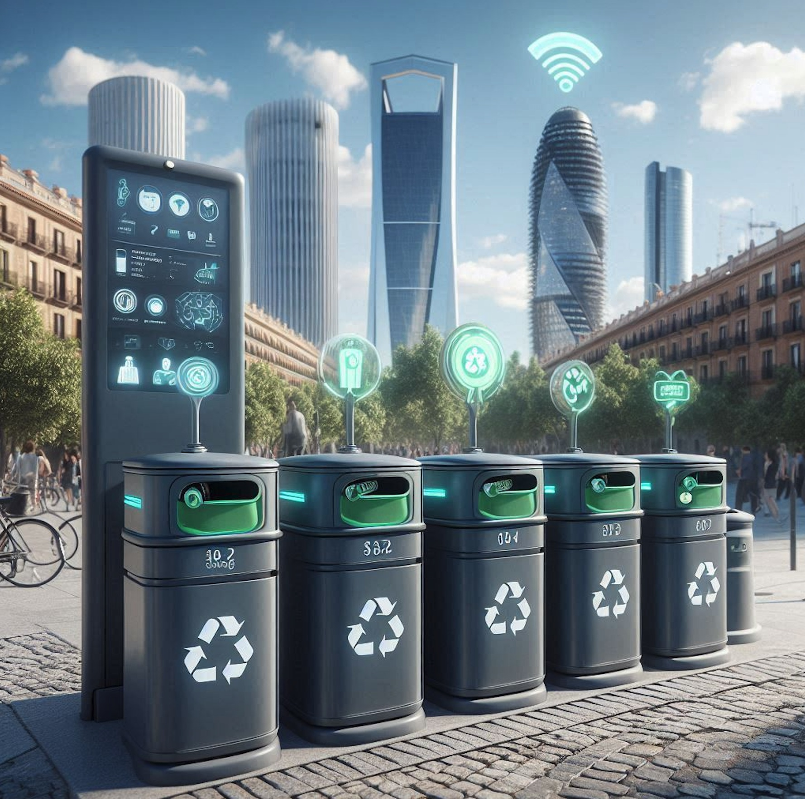

# Proyecto Final - Smart Waste 🗑️♻️

## 📋 Descripción del Proyecto
Este proyecto tiene como objetivo mejorar la gestión de residuos en la ciudad utilizando tecnologías inteligentes.
Nos centraremos en el análisis de datos relacionados con la **limpieza urbana** en la Comunidad de Madrid. Utilizaremos un dataset proporcionado por la comunidad, que incluye información detallada sobre distintos servicios de limpieza realizados en los distritos de la ciudad. A través de este proyecto, realizaremos un análisis integral que incluirá **limpieza de datos**, un **análisis exploratorio de datos (EDA)** y la aplicación de técnicas de **machine learning**.

## 🎯 Objetivos
1. **Ingesta y/o recolección de datos:** Obtención de datos a través de APIs, bases de datos públicas, web scraping, etc.
2. **Almacenamiento y tratamiento inicial:** Limpieza, conversión de formatos y verificación de calidad de los datos recolectados.
3. **Exploración de datos (EDA):** Análisis exploratorio con visualizaciones y estadísticas descriptivas para identificar patrones y tendencias.
4. **Desarrollo de modelo(s) de Machine Learning:** Creación de modelos predictivos que incluyan regresión, clasificación, clustering, series temporales o modelos de lenguaje (opcional).
5. **Deploy o presentación de resultados:** Implementación de los resultados en la nube o en un entorno local.
6. **Reporte y documentación finales:** Elaboración de un informe con conclusiones, insights y recomendaciones basadas en los análisis realizados.

## Características del Proyecto

- **Monitoreo en tiempo real**: Sensores inteligentes para monitorear los niveles de residuos.
- **Rutas óptimas**: Algoritmos para optimizar las rutas de recolección.
- **Análisis de datos**: Herramientas para analizar y predecir la generación de residuos.
- **Aplicación móvil**: Interfaz amigable para usuarios y administradores.

## 📊 Dataset
El dataset utilizado proviene de la Comunidad de Madrid y contiene las siguientes columnas principales:

1. **MES:** Mes en que se realizan los servicios.
2. **LOTE:** Lote del contrato de limpieza correspondiente.
3. **CÓDIGO DISTRITO:** Código numérico del distrito (1 al 21).
4. **DISTRITO:** Nombre del distrito correspondiente.
5. **RECOGIDA DE MUEBLES 010:** Pesaje en kg de muebles recogidos mediante servicio gratuito solicitado al 010.
6. **RECOGIDA DE MUEBLES PROGRAMADA:** Pesaje en kg de muebles recogidos en servicio programado mensual.
7. **RECOGIDA DE MUEBLES ABANDONADOS:** Pesaje en kg de muebles abandonados en la calle.
8. **RECOGIDA DE MUEBLES - TOTAL:** Total de muebles recogidos (sumatoria de las columnas anteriores).
9. **RESIDUOS VIARIOS – RESTO:** Pesaje en kg de residuos susceptibles de separación en plantas de reciclaje.
10. **RESIDUOS VIARIOS – ORGÁNICA:** Pesaje en kg de residuos orgánicos (ramas, hojas).
11. **RESIDUOS VIARIOS – ENVASES:** Pesaje en kg de envases recogidos en papeleras públicas.
12. **RESIDUOS VIARIOS – PAPEL Y CARTÓN:** Pesaje en kg de papel y cartón abandonados en la vía pública.
13. **RESIDUOS VIARIOS – RCDs/VARIOS:** Pesaje en kg de residuos no separados (escombros, basura).
14. **RESIDUOS VIARIOS – TOTAL:** Total de residuos recogidos (sumatoria de las columnas anteriores).
15. **BARRIDO MANUAL:** Número de barridos manuales realizados.
16. **BARRIDO MANTENIMIENTO:** Número de barridos manuales complementarios realizados.
17. **BARRIDO MECÁNICO:** Número de barridos realizados con máquina barredora.
18. **BARRIDO MIXTO:** Número de barridos combinados (máquina y sopladoras).
19. **BALDEO MECÁNICO:** Número de baldeos realizados con camión cisterna.
20. **BALDEO MIXTO:** Número de baldeos combinados (camión cisterna y personal).
21. **HIDROLIMPIADOR:** Número de servicios con vehículo hidrolimpiador.
22. **ELIMINACIÓN DE GRAFITIS:** Número de grafitis eliminados.
23. **ELIMINACIÓN DE GRAFITIS - M2:** Superficie en m² de grafitis eliminados.
24. **BOLSAS CANINAS:** Número de bolsas de excrementos caninos suministradas.

### 🔗 Fuente de los Datos
Los datos utilizados en este proyecto fueron obtenidos de la [Comunidad de Madrid](https://datos.madrid.es/portal/site/egob/menuitem.c05c1f754a33a9fbe4b2e4b284f1a5a0/?vgnextoid=6d45adbb460dd510VgnVCM2000001f4a900aRCRD&vgnextchannel=374512b9ace9f310VgnVCM100000171f5a0aRCRD&vgnextfmt=default) 🔗.

## 🛠️ Herramientas y Tecnologías
- **Python:** Para la limpieza de datos, EDA y modelado predictivo.
- **Pandas, NumPy:** Manejo y transformación de datos.
- **Matplotlib, Seaborn, Plotly:** Visualización de datos.
- **Scikit-learn:** Construcción y evaluación de modelos de machine learning.
- **Jupyter Notebook/VS Code:** Entorno de desarrollo.

## 📦 Entregables
1. **Notebook Documentado:** Incluyendo todo el flujo de trabajo desde la limpieza de datos hasta el análisis y modelado.
2. **Gráficos:** Visualizaciones claras y explicativas que reflejen los hallazgos más importantes.
3. **Modelo Predictivo:** Implementación de un modelo funcional y su respectiva evaluación de desempeño.
4. **Informe Final:** Resumen de los resultados obtenidos y recomendaciones basadas en los insights del análisis.

---
**¡Esperamos que disfrutes explorando este proyecto tanto como nosotros disfrutamos desarrollándolo!**

